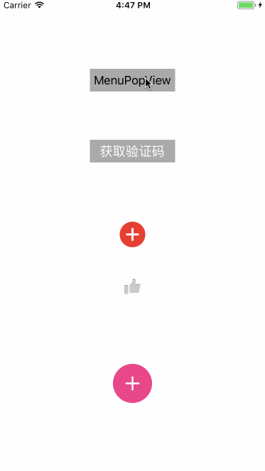

###  PathButton

```
//按钮散落方向 
typedef NS_ENUM(NSUInteger, PathDirection) {
    PathDirectionLeft,
    PathDirectionRight,
    PathDirectionUP,
    PathDirectionDown,
};
```

### MCFireworksButton

```
//将MCFireworksView粒子动画添加在button上
- (void)layoutSubviews {
    [super layoutSubviews];
    self.fireworksView.frame = self.bounds;
    [self insertSubview:self.fireworksView atIndex:0];
}
```


--------------------------


## [CFCollectionButtonView](https://github.com/CooFree/CFCollectionButtonView)(多个button按collectionView排列 网格式排列)

[](https://github.com/CooFree/CFCollectionButtonView)

